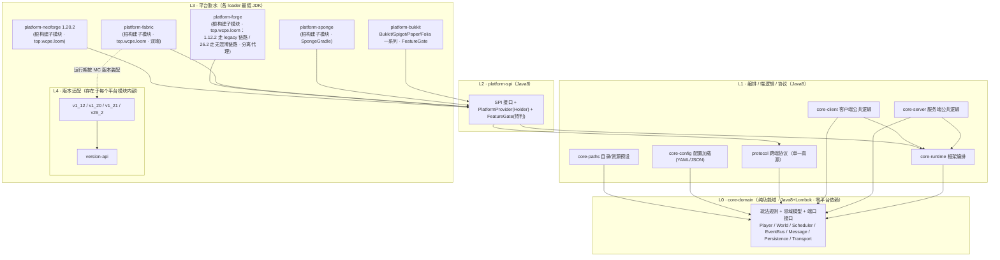
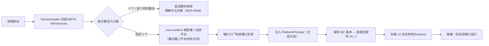
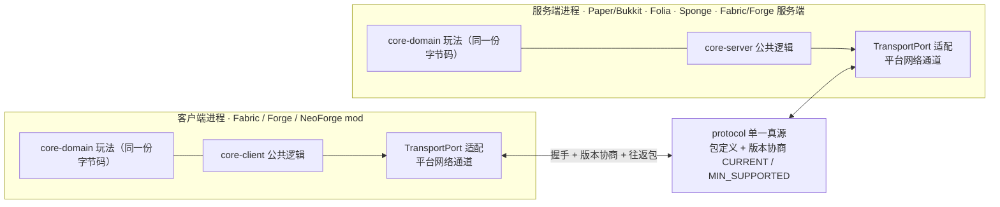

# 架构设计：MultiPlatformModTemplate

> 系统当前真貌（HOW）。始终原地更新到现状；结构 / 机制变了就改它。
> 重大取舍的"为什么"见 [`adr/`](adr/)，本文只描述"是什么、怎么协作"。

## 1. 定位与边界

MultiPlatformModTemplate（下称 **MPMT**）是一套**多平台 Minecraft mod 玩法脚手架 / 模板**：提供一套现成的分层项目骨架，开发者**克隆本模板**后在最内层（L0）写自己的玩法逻辑，即可同时落地到**任意服务端平台**（Paper/Folia 等 Bukkit 家族，及 Sponge）与**任意客户端 / 加载器平台**（Fabric/Forge/NeoForge），并桥接"服务端软件 ↔ 模组加载器"这条以往割裂的链路。

- **是什么**：分层的项目脚手架 = 平台无关的玩法骨架 + 平台抽象 SPI + 多版本适配机制 + 跨端通信协议。开发者在克隆出的工程里写玩法，不直接面对各平台 API 差异与版本差异。
- **交付与使用形态**：**克隆 / 复用模板仓库**（而非作为 Maven 依赖被引用的库 / SDK），在自己的副本里填玩法、构建各平台产物。
- **不是什么**：不是某个具体玩法插件 / 模组（本仓库只含**最小冒烟特性**作架构验证，不含产品级玩法，见 §7）；不是发布为依赖坐标供他人 import 的库 / SDK；不是 Architectury 那类"只跨 mod 加载器"的方案——MPMT 同时覆盖 Bukkit 家族服务端软件（见 [ADR-0007](adr/0007-composite-build-loader-isolation.md)）。
- **外部边界**：上接使用本模板的玩法开发者（在 L0/L1 写玩法）；下接各平台原生 API（Bukkit/Sponge/Fabric/Forge/NeoForge）与各 Minecraft 版本（NMS / 映射 / 加载器约定）。客户端与服务端之间经 MPMT 自定义协议通信。

## 2. 模块与依赖

### 2.1 分层模型（同心圆，依赖只能向内）

```
┌──────────────────────────────────────────────────────────────────┐
│ L0  core-domain   纯功能域：玩法规则 + 领域模型 + 端口(Port 接口)     │ Java8+Lombok·零平台依赖
├──────────────────────────────────────────────────────────────────┤
│ L1  core-runtime  框架编排：生命周期 / 特性注册 / 端口装配            │ Java8
│     core-server   服务端公共逻辑    core-client 客户端公共逻辑        │ Java8
│     protocol      跨端协议(单一真源·序列化经传输端口)                 │ Java8
├──────────────────────────────────────────────────────────────────┤
│ L2  platform-spi  平台抽象 SPI + PlatformProvider(Holder)           │ Java8·ServiceLoader 发现
│                   + 能力探测 / FeatureGate(承载"特判")               │
├──────────────────────────────────────────────────────────────────┤
│ L3  platform-bukkit（Bukkit/Spigot/Paper/Folia 一系列·FeatureGate） │ 普通 Java+shadow·实现 SPI
│     platform-{sponge,fabric,forge,neoforge}：均为根构建子模块       │ 统一 top.wcpe.loom·核心经 project(...) 依赖
├──────────────────────────────────────────────────────────────────┤
│ L4  各平台模块内的版本适配子层：version-api + v1_12 / v1_20 / …       │ 隔离 NMS / 映射 / API 漂移
└──────────────────────────────────────────────────────────────────┘
```

**铁律：依赖只能由外层（下层）指向内层（上层）。L0 完全不知道任何下层存在。** 玩法逻辑写在 L0，跨平台与跨版本的差异全部被 L3/L4 关在接口之后。详见 [ADR-0001](adr/0001-layered-architecture.md)。

### 2.2 模块清单与职责

| 层 | Gradle 模块 | 职责 | 依赖方向 |
|---|---|---|---|
| L0 | `core-domain` | **领域内核**（领域基类型 + 平台端口接口 + **自有 EventBus**，其订阅/发布接口为 `EventBusPort`、默认实现在内核）+ **各功能域**（玩法规则 / 领域模型(Lombok) / 领域服务 / 状态机）。平台端口含 `PlayerPort`/`WorldPort`/`SchedulerPort`/`MessagePort`/`PersistencePort`/`TransportPort`/`DataDirectoryPort`。**功能域之间互不依赖，跨域协作经 EventBus 转发**（ADR-0011） | 无（最内层） |
| L1 | `core-runtime` | 框架编排：生命周期、特性（Feature）注册、把端口实现装配给 L0 | → `core-domain` |
| L1 | `core-server` | 服务端公共玩法编排（跨所有服务端平台一致的部分） | → `core-domain`、`core-runtime` |
| L1 | `core-client` | 客户端公共逻辑（跨所有客户端加载器一致的部分：输入意图、HUD 模型、客户端状态；不含具体渲染调用） | → `core-domain`、`core-runtime` |
| L1 | `protocol` | 跨端协议的**单一真源**：包定义、版本号与协商、编解码（经 `TransportPort` 收发，不绑定具体网络栈） | → `core-domain` |
| L1 | `core-config` | 平台无关配置加载：YAML / JSON 等加载为类型化模型（依赖 snakeyaml + 轻量 JSON 库，Java 8） | → `core-domain` |
| L1 | `core-paths` | 客户端/服务端共享的目录与资源路径预设；基目录经 L0 `DataDirectoryPort` 由平台提供 | → `core-domain` |
| L2 | `platform-spi` | 平台抽象层：所有需由平台实现的 SPI 接口（`PlatformBootstrap`/`ServerAdapter`/`ClientAdapter` 及各端口工厂）、`PlatformProvider`（Holder 单例）、`ServiceLoader` 发现约定、`FeatureGate`/能力探测（承载"特判"） | → `core-domain`、`core-runtime`、`protocol` |
| L3 | `platform-bukkit`（根构建常规模块·普通 Java+shadow） | **Bukkit 家族单一插件构建**：覆盖 Bukkit/Spigot/Paper/Folia 一个系列；编译针对 Bukkit 基线、Paper/Folia 增强 API 用 `compileOnly`；运行期经 `FeatureGate` 适配（Folia 区域调度 vs 全局主线程），单个 jar 通用 | → L0/L1/L2 |
| L3 | `platform-sponge`（根构建子模块·SpongeGradle） | Sponge 胶水；车道为根子模块，SpongeGradle 与 loom 同构建共存（ADR-0026） | → L0/L1/L2（项目依赖） |
| L3 | `platform-fabric`（根构建子模块·top.wcpe.loom） | Fabric 胶水；含 server / client 双端入口 | → 同上 |
| L3 | `platform-forge`（根构建子模块·top.wcpe.loom；1.12.2 走 legacy 链路、26.2 走无混淆链路） | Forge 胶水；含 client / server 分离代理 | → 同上 |
| L3 | `platform-neoforge`（根构建子模块·top.wcpe.loom） | NeoForge 1.20.2 胶水；核心经项目依赖直接消费 | → 同上 |
| L4 | 各 `platform-*` 内的 `version-api` + `vX_Y` 子层 | 隔离该平台跨 MC 版本的 API 分歧；运行时按探测到的版本装配对应实现 | 平台模块内部 |
| 验证 | `smoke`（不发布） | 最小冒烟特性：①同一份 L0 领域逻辑经端口在三平台一致运行（验证"逻辑/胶水分离"）；②异构客户端经 protocol 与异构服务端互通（验证"服务端软件↔加载器桥接"） | → L0/L1，运行期叠加任一 L3 |
| 验证 | `acceptance`（不发布·仅测试设施） | realserver 验收 harness 平台无关核心（ADR-0014）：测试控制协议 + codec、`AcceptanceClient` 客户端排程协调（seq/future/latch/超时）、单一权威报告、**服务端 GameTest 框架**（`ServerGameTest`/`ServerGameTestContext`/`ServerGameTestRegistry`/`ServerGameTestRunner` 四态归类+用例隔离/`ServerScenario` 基类）。**独立于产品协议、不入产品 jar**，仅各平台 gametest 源集消费 | 无产品依赖（手写 codec / 纯 JVM） |

> **依赖单向校验**：L0 不得 `import` 任何 Bukkit/Minecraft/Fabric/Forge 类；L1 不得 `import` 平台原生类（只认端口与 SPI）；平台细节只允许出现在 L3/L4。这条由 [`architecture-invariants`](../.claude/rules/architecture-invariants.md) 红线守护。

> **根包**：Java 包根与 Gradle group 均为 `top.wcpe.mc.mpmt`（含项目名段 `mpmt`，不可漏）；各模块按 `top.wcpe.mc.mpmt.<层>.<模块>` 组织，例如 `top.wcpe.mc.mpmt.core.domain`、`top.wcpe.mc.mpmt.protocol`、`top.wcpe.mc.mpmt.platform.spi`、`top.wcpe.mc.mpmt.platform.fabric`、`top.wcpe.mc.mpmt.platform.fabric.version.v1_20`、功能域 `top.wcpe.mc.mpmt.domain.<名>`。

> **L0 内部结构**：L0 = 领域内核（基类型 + 端口 + 自有 EventBus）+ 多个功能域；**功能域互不依赖，跨域协作经 EventBus**；**全依赖图无环、同层域之间无互依**（ADR-0011）。**域组织与成长约定**——域 = `core-domain` 内的包、只依赖内核 + EventBus、core-runtime 注册装配、够大再提升为独立模块、**不预建空域**——见 [ADR-0015](adr/0015-domain-organization.md)。

### 2.3 客户端 / 服务端分离（双端代理）

- 服务端逻辑（`core-server`）与客户端逻辑（`core-client`）物理分模块；端到端只经 `protocol` 通信。
- 各平台的客户端 / 服务端入口分离——**Fabric 的 main/client 双端入口**与 **Forge 的 client/server 分离代理**是"需求：客户端/服务端逻辑分离"在两种平台上的两种实现形态，统一对应用户提出的"Forge 客户端 + Forge 服务端分离代理"。
- 任意服务端平台 × 任意客户端平台可自由组合，因双方只依赖同一份 `protocol` 契约。

**用户点名的组合矩阵**（"任意 × 任意"落到具体格子；标注验证归属）：

| 客户端 \ 服务端 | Paper/Bukkit（服务端软件） | Forge 服务端 | Fabric 服务端 |
|---|---|---|---|
| **Fabric 客户端** | ✓ 桥接（用户点名）· MVP 验证 | ✓ | ✓ MVP 验证 |
| **Forge 客户端** | ✓ 桥接（用户点名）· MVP 验证 | ✓ 双端代理（用户点名）· MVP 验证 | ✓ |
| **NeoForge 客户端** | ✓ 桥接 · MVP 验证 | ✓ MVP 验证 | ✓ MVP 验证 |

> 其中"客户端 mod ↔ Bukkit 服务端插件"（如 Fabric/Forge 客户端 ↔ Paper 服务端）是最关键也最难的异构桥接链路，正是区别于 Architectury 类方案的核心价值，列为 MVP 实机验收项（见 PRD §6）。Folia/Sponge/NeoForge 的基础网络与示例支持现属第一期（P1，FR-13~FR-15）；仅 CatServer 实跑（需 1.12.2）与 Folia 区域调度的实机验证维度属 P2。**互通前提**：双端均须装我方组件并注册同一通道（非"协议天然打通"，未装方按非本协议端降级）；Bukkit 家族封禁为"进服后即踢"（插件消息仅 PLAY 阶段可用），详见 [ADR-0006](adr/0006-cross-end-protocol.md) / network spec。

### 2.4 架构图

**图 1 · 分层与依赖**（箭头 = 依赖方向，只能由外层指向内层；L0 无出边）



**图 2 · 平台发现与装配**（启动期一次性，依据 ADR-0002 / ADR-0003）



**图 3 · 跨端桥接拓扑**（任意客户端 ↔ 任意服务端，共用同一份 protocol，依据 ADR-0006）



**图 4 · 构建组成（单一根构建，平台车道均为子模块 · 公共流程在约定插件）**（依据 ADR-0026 / ADR-0025 / ADR-0027）

```mermaid
flowchart TB
    subgraph ROOT["根构建 settings.gradle.kts（Gradle 9.6.1 · 守护 JVM ≥ 25）"]
        CORE["共享核心（常规 java-library · Java8）<br/>core-domain / core-runtime / core-server / core-client / protocol / platform-spi"]
        BUKM["platform-bukkit（常规模块 · 普通 Java+shadow）<br/>Bukkit/Spigot/Paper/Folia 一系列"]
        FABB["platform-fabric 1.20.1 / 1.21.1 / 26.2<br/>top.wcpe.loom（26.2 为 no-remap 变体）"]
        FORB["platform-forge 1.12.2 / 1.20.1 / 1.21.1 / 26.2<br/>top.wcpe.loom（legacy / 无混淆链路）"]
        NEOB["platform-neoforge 1.20.2 · top.wcpe.loom"]
        SPOB["platform-sponge 1.20.1 · SpongeGradle"]
    end
    PLUG["build-logic/realserver-acceptance<br/>真服验收编排约定插件（pluginManagement includeBuild）"]
    CONV["build-logic/build-conventions<br/>构建约定插件：quality / platform / loader / release<br/>（车道脚本只做配置）"]

    BUKM --> CORE
    FABB -->|"project(\":core:…\") 项目依赖"| CORE
    FORB -->|"项目依赖"| CORE
    NEOB -->|"项目依赖"| CORE
    SPOB -->|"项目依赖"| CORE
    ROOT -. pluginManagement includeBuild .-> PLUG
    ROOT -. pluginManagement includeBuild .-> CONV
```

> 关键：全部平台车道都是**同一个根构建的普通子模块**，由根 `settings.gradle.kts` 直接 `include`，不再有复合构建隔离——加载器插件冲突的前提已由 [ADR-0025](adr/0025-wcpe-loom-toolchain-unification.md)（mod 平台构建插件统一为 `top.wcpe.loom` 1.17.1）消除，故 [ADR-0026](adr/0026-single-build-subproject-unification.md) 取消车道级独立构建。车道消费核心一律用 `project(":core:domain")` 这类**项目依赖**（原经复合构建依赖替换 / 受控内部 JAR）；车道不再有 `settings.gradle.kts`、自有 wrapper、反向 `includeBuild`。保留的 `includeBuild` 只有两个 **Gradle 插件工程**（经 `pluginManagement` 引入，属构建基础设施，不属平台隔离）：`build-logic/realserver-acceptance`（真服验收编排）与 `build-logic/build-conventions`（构建约定插件）。Bukkit 家族无专属冲突插件，作根构建常规模块；SpongeGradle 与 loom 同处一个构建已实测共存。
>
> **构建逻辑分层**（[ADR-0027](adr/0027-build-convention-plugins.md)）：车道的公共流程不再写在各车道脚本里，而是集中在 `build-conventions` 的分层插件中——`build-conventions.quality`（静态分析与覆盖率门禁）、`build-conventions.platform`（平台公共层）、`build-conventions.<loader>`（fabric / bukkit / forge / neoforge / sponge 五层 loader 流程）、`build-conventions.release`（根侧发布聚合与真服/版本矩阵门禁编排）。插件 id 用功能语义、不含项目身份。**车道脚本只留"本车道是什么"的参数与偏离项**：MC / loader 版本、目标 JDK、L4 选择、报告路径、确有差异的依赖与断言；重复出现的 loader 流程性代码即为设计异味。任务名与路径、13 个发布 jar 的名称与字节、报告路径与 `SERVER-GAMETEST-REPORT v2` 格式、`-Pmpmt.acceptance.*` 属性名与默认值、门禁判定强度与失败文案属**不可变契约**，抽取只搬实现、不动契约。

### 2.5 P2 已交付：版本矩阵与工具链隔离

> P2（FR-12）已在 **v0.2.0** 交付；R1–R6 合规矩阵、`:runVersionMatrixGate` 与用户第二期实机确认是该期证据。当前实现状态仍以 PRD §4 为准。

P2 采用非笛卡尔积版本矩阵、按版本隔离的 Forge 工具链、L4 裸 payload golden vectors，以及绑定本轮 JVM/制品/场景的 realserver v2 权威报告。唯一聚合入口为 **Gradle** `./gradlew :runVersionMatrixGate`（`build-logic/realserver-acceptance` 约定插件 + 根薄包装；可选 mc-testkit 辅车道），**禁止** shell 剧本；串行验证版本矩阵核心与受影响的 1.20.1 基线。Sponge、NeoForge、**26.2 / REALSERVER262** 不属于版本矩阵门；全 lane 另用 `:runRealServerAcceptance`，26.2 REALSERVER262 真服专用聚合为 `:runRealServerGate262`。完整冻结事实见 [`specs/p2-version-matrix.md`](specs/p2-version-matrix.md)，长期裁决见本仓 [ADR-0021](adr/0021-p2-version-matrix-toolchain-isolation.md)（已接受；勿与 AllinCore-New ADR-0020 混淆）。

> 历史注记：本节的"按版本隔离的 Forge 工具链"是 P2 交付时的事实；自 [ADR-0025](adr/0025-wcpe-loom-toolchain-unification.md) 起，Forge 1.20.1 / 1.21.1 / 1.12.2 / 26.2 与 NeoForge 车道已并入统一 `top.wcpe.loom` 1.17.1 + Gradle 9.6.1 车道，版本隔离不再成立；自 [ADR-0026](adr/0026-single-build-subproject-unification.md) 起这些车道更进一步统一为根构建子模块。本段其余语义不变。

**验收编排两车道（Gradle only）**：
- **B 主车道**：全服务端 lane + 各 loader **自有 gametest/acceptance 客户端**进服 + 权威报告 `RESULT PASS`；约定插件 `top.wcpe.mc.mpmt.realserver-acceptance`。**B 增强**：`PaperHostService` BuildService 按目标工程隔离，可用目标 Java、REALSERVER262 轮次与制品元数据后台起 Paper、部署产品/验收 jar（`-P mpmt.realserver.autoHost=true` / `ensurePaperRealServerHost`）；跨 loader 的 Fabric 客户端伴侣仍作为独立 Gradle 进程接入。
- **A 辅车道**：根工程 `top.wcpe.mc-testkit` + `e2e/harness` 桩 + `e2e/bot`；`runMcTestkitSmoke` / `runMcTestkitFoliaSmoke` 用真实 Paper/Folia + bot/桩结果文件，**不**替代 B 的 mod 客户端门禁。

## 3. 数据模型

- **领域模型（L0）**：用 Lombok 编写的不可变值对象 / 实体（玩法实体、玩法状态、配置模型）。无任何平台类型，可在纯 JVM 单元测试中穷举。
- **协议模型（`protocol`）**：跨端传输的 DTO + 包定义，含协议版本号（`CURRENT` / `MIN_SUPPORTED`）；序列化格式与字节布局是**单一真源**，客户端与服务端共用同一定义（借鉴 AllinCore 的 ProtocolManifest 思路）。
- **平台模型边界**：平台原生对象（Bukkit `Player`、Minecraft `ServerPlayer` 等）**不得**进入 L0/L1，只能在 L3 内部由适配器包装为端口暴露的领域视图。
- **持久化**：经 `PersistencePort` 抽象，具体存储（文件 / 数据库）由平台或宿主决定，L0 不感知。

## 4. 接口

详细契约见 [`API.md`](API.md)，此处只给概览与定位：

- **面向玩法开发者（对外主 API）**：L0 端口接口 + L1 的特性注册 / 编排入口。开发者写玩法 = 实现领域逻辑 + 通过端口请求能力。
- **面向平台实现者（SPI）**：`platform-spi` 的 `PlatformBootstrap` / `ServerAdapter` / `ClientAdapter` / 端口工厂 / `FeatureGate`。新增一个平台 = 实现这组 SPI 并经 `ServiceLoader` 注册。
- **跨端契约**：`protocol` 的包定义与版本协商规则，是客户端与服务端之间的唯一接口面。
- **访问入口（Holder）**：`PlatformProvider` 提供运行期对当前平台能力的访问，类比 AllinCore 的 `AllinCoreProvider`。

## 5. 关键机制

- **平台发现与装配**：进程启动时，平台胶水经 `ServiceLoader`（`META-INF/services`）注册 `PlatformBootstrap`；**发现 / 装配编排在 L2 `platform-spi`**（`PlatformProvider.boot` → `PlatformAssembler` 发现唯一活跃平台、零 / 多入口失败快 → 平台 `assemble` 把端口注入 L1 `core-runtime` 的 `RuntimePorts` → 固化平台标识与 `FeatureGate` 为只读 Holder；**进程级单一活跃绑定**经 JVM 全局系统属性 `top.wcpe.mc.mpmt.active-platform` 跨类加载器把关——融合服（CatServer 等 Forge+Bukkit 同进程）上我方 Bukkit 插件与 Forge mod 各自类加载器、per-classloader 静态拦不住"我方多入口同时激活"，由该属性失败快，`deactivate` 在 disable 时释放以支持 `/reload`；Bukkit 入口探测 `HYBRID_FORGE_BUKKIT`（Forge 标志类）即记融合服感知、绑定 Bukkit 家族为唯一活跃平台、不激活我方 Forge 入口（FR-25 / ADR-0008，实跑随 1.12.2 属 P2）），随后加载 L0 特性。**L1 只接收注入、不依赖 L2**（守 ADR-0001 依赖方向）。详见 [ADR-0002](adr/0002-platform-abstraction-spi.md) 与其执行边界细化 [ADR-0017](adr/0017-assembly-orchestration-in-l2.md)。
- **多版本适配**：平台模块内 `version-api` 声明随 MC 版本分歧的操作；运行时探测 MC 版本，选择 `vX_Y` 实现装配。锚点版本：**1.12.2 / 1.20.1 / 1.21.1 / 26.2**（26.2 为 MC 今年最新版本号、新版号方案无 `1.` 前缀，模块 `v26_2`），前向可扩展（加新版本=加一个 `vX_Y` 模块）。详见 [ADR-0003](adr/0003-multi-version-adapter.md)。
  - **Bukkit（方案 C 阶段 2）**：`version-api` + `modern` + `v1_12`/`v1_20`/`v1_21` 多源集；`-P mpmt.minecraftVersion=1.12.2|1.20.1(默认)|1.21.1` 每构建只打唯一 L4（ServiceLoader）。公共 L3 用 1.12 API/JDK8；Folia 仅 modern。产物 `mpmt-bukkit-$mc`。
  - **Fabric（方案 C 阶段 2）**：`version-api` + 选中 `v1_20` 或 `v1_21`（无 1.12）；`-P mpmt.minecraftVersion=1.20.1|1.21.1`；`SelectedFabricVersionFactory` + 运行期 `requireExactMatch`。产物 `mpmt-fabric-$mc`。gametest 经 L4 收发，避免绑死 1.20 网络 API。
  - **Forge**：主工程 1.20.1；跨大版本旁路子工程 `legacy-1_12` / `modern-1_21`（非单模块多源集）。
  - **NeoForge**：锚点 **1.20.2**（无官方 1.20.1）；1.21.1 车道未在 C-2 首批落地。
- **"特判"承载（FeatureGate）**：`FeatureGate` 是运行期的**能力探测**——平台无关代码问"当前平台 / 版本是否具备某能力"（如"是否 Folia 区域调度可用""该版本是否有某 API"），据此分流，而非在公共层硬编码平台 / 版本 if-else。它探测"能干什么"而非"你是谁"（capability detection，非平台嗅探）。**与端口分工**：端口（Port）是"要某能力"的统一调用面，FeatureGate 是"当前环境有没有该能力"的判定；二者配合让同一份 L0 逻辑跑遍异构平台。接口定义在 L2 `platform-spi`、各平台 L3 实现。**典型例**：探测到 Folia 时 `SchedulerPort` 实现选用 `RegionScheduler`，否则用全局调度——L0 只调 `SchedulerPort`，对底层差异无感。符合"禁止散落 if-else/switch 堆砌可变逻辑"的反模式禁令。
- **跨端通信**：客户端 ↔ 服务端经 `protocol` 自定义协议通信，握手时做版本协商（`MIN_SUPPORTED` 兼容判断）；底层传输经 `TransportPort` 适配到各平台的网络通道。详见 [ADR-0006](adr/0006-cross-end-protocol.md)。
- **命令模型**：命令入口在 L3 平台胶水，各平台用**原生命令框架**（Bukkit/Paper/Sponge 原生、Fabric/Forge/NeoForge Brigadier；**不引入 TabooLib**），执行逻辑在共享 L0/L1，L3 不写执行逻辑；L2 仅提供薄 `CommandRegistrar` 接缝（注册 + 转发，非命令框架）。详见 [ADR-0009](adr/0009-command-config-framework.md)。
- **配置与资源路径**：配置经平台无关 `core-config`（YAML/JSON）加载；目录 / 资源位置由 `core-paths` 预设、基目录经 `DataDirectoryPort` 平台提供，调用方引用预设、不自算路径。详见 [ADR-0010](adr/0010-config-and-resource-paths.md)。
- **事件驱动与域间解耦**：自有 EventBus（L0 内核，平台无关；其订阅/发布接口为 `EventBusPort`，默认实现在 L0 内核、非平台端口）承载发布 / 订阅 + **域间事件转发**；功能域只经事件协作、**不直接依赖兄弟域**；平台事件经 L3 适配器桥接入总线。详见 [ADR-0011](adr/0011-eventbus-domain-decoupling.md)。
- **线程模型与线程安全**：涉及**服务端主线程**（命令 / 监听器 / tick）、**netty 网络线程**（包收发）、**客户端渲染线程**（HUD / 消息渲染）。**Folia 无单一主线程**——网络接收 / 命令处理碰游戏 / 领域状态前经 `SchedulerPort` 按**归属**切到正确线程（`runForEntity`/`runForLocation`/`runGlobal`，而非笼统"主线程"）；客户端渲染只在渲染线程读不可变快照（volatile 引用交换）、**不在渲染线程改共享状态**；共享可变状态（封禁表 / 会话表）须线程安全。详见 [ADR-0013](adr/0013-threading-and-scheduling.md)。
- **Java 版本策略**：L0–L2（平台无关核心）严格编译为 **Java 8** 字节码以最大化兼容（连 1.12 Forge 都能加载）；现代版本的平台胶水（Fabric 1.18+ / NeoForge 等）受 Mojang 强制按各 loader 最低 JDK 编译，但仍依赖 Java 8 核心。**L0–L2 须以 `javac --release 8` 或 animal-sniffer 强制只用 JDK 8 API**（仅锁 `sourceCompatibility` 不够，否则误用 9+ API 在 1.12.2 运行期 NoSuchMethod）。详见 [ADR-0004](adr/0004-java8-core-lombok.md)。

## 6. 部署

- **构建产物**：每个目标平台产出各自的可加载件——Bukkit 家族为插件 jar（含 `plugin.yml`），Fabric 的旧混淆版本为 Loom 重映射 mod jar、26.1+ 为无混淆链路产物（`fabric.mod.json`），Forge/NeoForge 为对应 mod jar（`mods.toml` / `neoforge.mods.toml`）。各产物内打包 L0–L2 核心 + 对应 L3/L4 胶水。
- **构建工具**：Gradle **9.6.1** 单一根构建（Kotlin DSL，平台车道为根构建子模块）；L0–L2、Bukkit 家族（`platform-bukkit`）与全部平台车道（fabric / forge / neoforge / sponge）同处一个根构建 —— mod 平台构建插件统一为 WCPE Loom（`top.wcpe.loom` 1.17.1，26.2 两车道用 no-remap 变体），Sponge 车道用 SpongeGradle，加载器插件由根 `pluginManagement` 单点 pin，见 [ADR-0025](adr/0025-wcpe-loom-toolchain-unification.md) / [ADR-0026](adr/0026-single-build-subproject-unification.md)。车道消费核心经 `project(":core:domain")` 项目依赖（无依赖替换 / 无受控内部 JAR）；根构建**硬要求守护 JVM ≥ 25**（26.2 两车道在配置期硬校验）。**构建逻辑分层**：静态分析 / 平台公共层 / 各 loader 流程 / 根侧发布编排集中在 `build-logic/build-conventions` 的分层约定插件（`quality` / `platform` / `<loader>` / `release`），**车道脚本只做配置**（参数与偏离项），见 [ADR-0027](adr/0027-build-convention-plugins.md)。第三方依赖统一 relocate、core 打进各产物的方式见 [ADR-0012](adr/0012-packaging-and-dependency-isolation.md)。Minecraft 26.1+ 使用无混淆原始命名和加载器构建链路，见 [ADR-0022](adr/0022-unobfuscated-minecraft-naming-policy.md)（已取代 ADR-0016；旧版本继续按其规则）。平台车道隔离的旧方案见 [ADR-0007](adr/0007-composite-build-loader-isolation.md) 决策 2（已被 ADR-0026 取代；ADR-0007 取代 [ADR-0005](adr/0005-build-toolchain.md)）。
  - **当前落地**（进度以 PRD §4 FR 状态为权威）：根 Gradle wrapper 为 **9.6.1**（全车道统一），mod 平台构建插件统一为 `top.wcpe.loom` 1.17.1（ADR-0025），全部平台车道为根构建子模块（ADR-0026）；L0–L2 仍是 Java 8 的平台无关核心，P1 与 P2（FR-12）分别已在 v0.1.0、v0.2.0 交付。P3 的 26.2 仅有 Bukkit、Fabric、Forge 三条在制车道，均为根构建子模块（工程路径 `:platform:fabric:fabric-26.2`、`:platform:forge:forge-26.2`）。26.1+ 的无混淆命名策略由 ADR-0022 裁决；REALSERVER262 只覆盖三个公共场景，且 ADR-0023 将该严格门定为 FR-16 的最终自动化验收；FR-17 的远端发布尚未执行，故三项仍保持开发中。
- **P3 当前边界**：26.2 仅有 `platform/bukkit/26.2`、`platform/fabric/26.2` 与 `platform/forge/26.2` 三条有效车道，三者均为根构建子模块、均在开发中。REALSERVER262 只要求 `product-handshake`、`product-roundtrip` 与 `client-hud` 三个公共场景；同轮 REALSERVER262 报告经严格门验证是 FR-16 交付前置条件。版本矩阵（STANDARD/HYBRID/SCHEDULER）不覆盖 26.2。
- **远端交付治理**：GitHub Actions（FR-32）在 Hosted Runner 固定 mc-testkit 本地 Maven 回退后，以 **JDK 25 守护**运行单一根构建的 `:buildAll`（Java 8/17/21/25 均显式安装，8/17/21 仅供 toolchain 解析），并提供手动 Release、依赖审查和 CodeQL。它属于交付治理层，不加入产品依赖图；CI 构建结果不能替代 ADR-0014 / ADR-0023 的本机 realserver/REALSERVER262 证据，详见 ADR-0024。
- **运行拓扑**：服务端进程（Paper/Folia/Sponge/Fabric-server/Forge-server）+ 客户端进程（Fabric/Forge/NeoForge 客户端），二者经协议通信；亦支持单机（客户端内置服务端）。
- 部署 / 运行细节见 [`OPERATIONS.md`](OPERATIONS.md)。

## 7. 关键裁决与不做项

**关键裁决**（各对应一条 ADR）：
- [ADR-0001] 分层架构与依赖方向（六边形 / 端口-适配器，L0–L4 向内依赖）。
- [ADR-0002] 平台抽象机制：SPI + ServiceLoader + PlatformProvider。
- [ADR-0003] 多版本适配：L4 版本适配层 + 锚点版本。
- [ADR-0004] Java 8 核心 + Lombok；胶水随 loader JDK。
- [ADR-0005 → ADR-0007 → ADR-0026] 构建组成：平台车道统一为**单一根构建子模块**（插件统一 `top.wcpe.loom` 后不再需要复合构建隔离；仍弃用 Architectury，因需覆盖 Bukkit/Sponge）；Bukkit 家族单构建经 FeatureGate 收敛 Paper/Folia。
- [ADR-0006] 跨端通信协议：自定义协议 + 版本协商。
- [ADR-0008] 融合服支持与活跃平台语义细化：区分"平台存在 vs 活跃绑定"，支持 CatServer。
- [ADR-0009] 命令框架策略：各平台用各自原生命令框架（不引入 TabooLib），入口 L3、执行抽到共享。
- [ADR-0010] 配置与资源路径：平台无关共享模块（YAML/JSON 加载 + 预设目录/资源位置）。
- [ADR-0011] 功能域事件驱动解耦：自有 EventBus 作域间转发，域间禁止直接 / 循环依赖。
- [ADR-0012] 打包与依赖隔离：第三方依赖 relocate、core 进各平台产物（M0 spike 先行）。
- [ADR-0013] 线程模型与归属调度：Folia 无主线程，SchedulerPort 按归属调度。
- [ADR-0014] realserver 验收：服务端驱动 / 客户端验证 / 单一权威报告（镜像 AllinCore-New ADR-0020）。
- [ADR-0015] 功能域组织与拆分约定：域模板 + 注册 + 包→模块成长，不预建空壳。
- [ADR-0016 → ADR-0022] 反混淆映射策略：旧混淆版本沿用 ADR-0016；Minecraft 26.1+ 使用无混淆原始命名与加载器构建链路。
- [ADR-0017] 平台发现 / 装配编排归属 L2 platform-spi（细化 ADR-0002，守 L1⊄L2）。
- [ADR-0020] Sponge 第一期开箱运行基线固定为 RC1365 与 Java 17；固定时间戳 SpongeAPI 制品，未来新连接状态 API 独立适配。
- [ADR-0021] P2 有效版本矩阵、工具链隔离与严格验收入口；P2 明确不包含 26.2（工具链隔离部分被 ADR-0025 取代）。
- [ADR-0022] Minecraft 26.1+ 无混淆命名与加载器构建策略，取代 ADR-0016。
- [ADR-0023] P3 R7 严格自动化验收作为 FR-16 的最终发布权威，仅限其真实进程 Gradle 证据。
- [ADR-0024] GitHub Actions 远端质量门与真服验收分离。
- [ADR-0025] 构建插件统一 WCPE Loom（`top.wcpe.loom` 1.17.1）并收敛 Gradle 车道至 9.6.1；部分取代 ADR-0021 的工具链隔离。
- [ADR-0026] 平台车道统一为根构建子模块（取消加载器插件隔离）；取代 ADR-0007 决策 2，部分取代 ADR-0021 决策 2，并规定根构建硬要求守护 JVM ≥ 25。
- [ADR-0027] 构建约定插件分层：公共构建流程进插件工程（`build-conventions.quality` / `.platform` / `.<loader>` / `.release`）、车道脚本只做配置、插件 id 不含项目身份。

**当前不做（明确边界）**：
- 不含产品级玩法，仅 `smoke` 冒烟特性验证架构（交付形态 = 脚手架 / 模板，克隆复用而非发布为依赖库）。
- 首期不覆盖全部平台与全部版本：见 [`PRD.md`](PRD.md) §7 分期与 [`scope-discipline`](../.claude/rules/scope-discipline.md)。
- 不引入 Architectury / 重型 DI 容器 / 反射魔法作为默认机制（需要时先走 ADR）。
