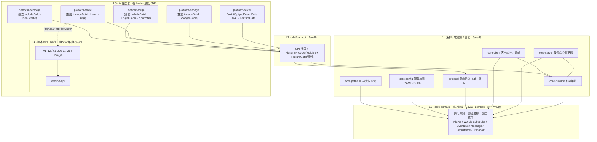
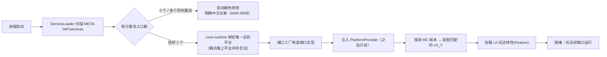
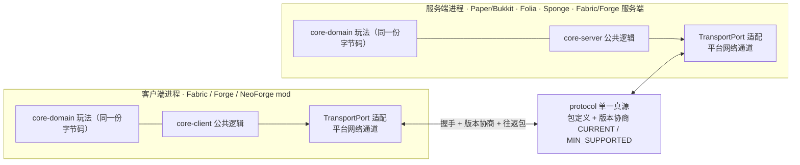
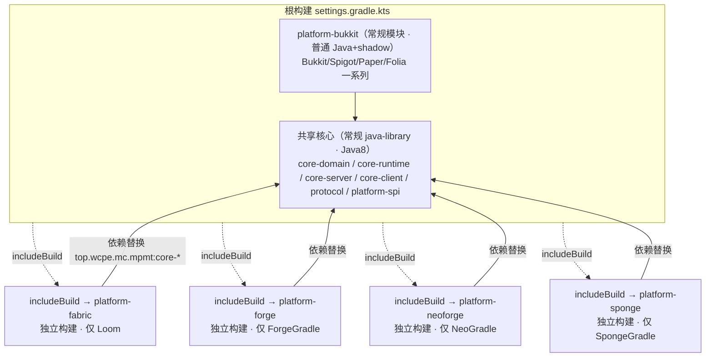

# 架构设计：MultiPlatformModTemplate

> 系统当前真貌（HOW）。始终原地更新到现状；结构 / 机制变了就改它。
> 重大取舍的"为什么"见 [`adr/`](adr/)，本文只描述"是什么、怎么协作"。

## 1. 定位与边界

MultiPlatformModTemplate（下称 **MPMT**）是一套**多平台 Minecraft mod 玩法脚手架 / 模板**：提供一套现成的分层项目骨架，开发者**克隆本模板**后在最内层（L0）写自己的玩法逻辑，即可同时落地到**任意服务端平台**（Paper/Folia 等 Bukkit 家族，及 Sponge）与**任意客户端 / 加载器平台**（Fabric/Forge/NeoForge），并桥接"服务端软件 ↔ 模组加载器"这条以往割裂的链路。

- **是什么**：分层的项目脚手架 = 平台无关的玩法骨架 + 平台抽象 SPI + 多版本适配机制 + 跨端通信协议。开发者在克隆出的工程里写玩法，不直接面对各平台 API 差异与版本差异。
- **交付与使用形态**：**克隆 / 复用模板仓库**（而非作为 Maven 依赖被引用的库 / SDK），在自己的副本里填玩法、构建各平台产物。
- **不是什么**：不是某个具体玩法插件 / 模组（本仓库只含**最小冒烟特性**作架构验证，不含产品级玩法，见 §7）；不是发布为依赖坐标供他人 import 的库 / SDK；不是 Architectury 那类"只跨 mod 加载器"的方案——MPMT 同时覆盖 Bukkit 家族服务端软件（见 [ADR-0007](adr/0007-composite-build-loader-isolation.md)）。
- **外部边界**：上接使用本模板的玩法开发者（在 L0/L1 写玩法）；下接各平台原生 API（Bukkit/Sponge/Fabric/Forge/NeoForge）与各 Minecraft 版本（NMS / 映射 / 加载器约定）。客户端与服务端之间经 MPMT 自定义协议通信。

## 2. 模块与依赖

### 2.1 分层模型（同心圆，依赖只能向内）

```
┌──────────────────────────────────────────────────────────────────┐
│ L0  core-domain   纯功能域：玩法规则 + 领域模型 + 端口(Port 接口)     │ Java8+Lombok·零平台依赖
├──────────────────────────────────────────────────────────────────┤
│ L1  core-runtime  框架编排：生命周期 / 特性注册 / 端口装配            │ Java8
│     core-server   服务端公共逻辑    core-client 客户端公共逻辑        │ Java8
│     protocol      跨端协议(单一真源·序列化经传输端口)                 │ Java8
├──────────────────────────────────────────────────────────────────┤
│ L2  platform-spi  平台抽象 SPI + PlatformProvider(Holder)           │ Java8·ServiceLoader 发现
│                   + 能力探测 / FeatureGate(承载"特判")               │
├──────────────────────────────────────────────────────────────────┤
│ L3  platform-bukkit（Bukkit/Spigot/Paper/Folia 一系列·FeatureGate） │ 普通 Java+shadow·实现 SPI
│     platform-{sponge,fabric,forge,neoforge}：各为独立 includeBuild  │ 复合构建隔离专属插件·各 loader JDK
├──────────────────────────────────────────────────────────────────┤
│ L4  各平台模块内的版本适配子层：version-api + v1_12 / v1_20 / …       │ 隔离 NMS / 映射 / API 漂移
└──────────────────────────────────────────────────────────────────┘
```

**铁律：依赖只能由外层（下层）指向内层（上层）。L0 完全不知道任何下层存在。** 玩法逻辑写在 L0，跨平台与跨版本的差异全部被 L3/L4 关在接口之后。详见 [ADR-0001](adr/0001-layered-architecture.md)。

### 2.2 模块清单与职责

| 层 | Gradle 模块 | 职责 | 依赖方向 |
|---|---|---|---|
| L0 | `core-domain` | **领域内核**（领域基类型 + 平台端口接口 + **自有 EventBus**，其订阅/发布接口为 `EventBusPort`、默认实现在内核）+ **各功能域**（玩法规则 / 领域模型(Lombok) / 领域服务 / 状态机）。平台端口含 `PlayerPort`/`WorldPort`/`SchedulerPort`/`MessagePort`/`PersistencePort`/`TransportPort`/`DataDirectoryPort`。**功能域之间互不依赖，跨域协作经 EventBus 转发**（ADR-0011） | 无（最内层） |
| L1 | `core-runtime` | 框架编排：生命周期、特性（Feature）注册、把端口实现装配给 L0 | → `core-domain` |
| L1 | `core-server` | 服务端公共玩法编排（跨所有服务端平台一致的部分） | → `core-domain`、`core-runtime` |
| L1 | `core-client` | 客户端公共逻辑（跨所有客户端加载器一致的部分：输入意图、HUD 模型、客户端状态；不含具体渲染调用） | → `core-domain`、`core-runtime` |
| L1 | `protocol` | 跨端协议的**单一真源**：包定义、版本号与协商、编解码（经 `TransportPort` 收发，不绑定具体网络栈） | → `core-domain` |
| L1 | `core-config` | 平台无关配置加载：YAML / JSON 等加载为类型化模型（依赖 snakeyaml + 轻量 JSON 库，Java 8） | → `core-domain` |
| L1 | `core-paths` | 客户端/服务端共享的目录与资源路径预设；基目录经 L0 `DataDirectoryPort` 由平台提供 | → `core-domain` |
| L2 | `platform-spi` | 平台抽象层：所有需由平台实现的 SPI 接口（`PlatformBootstrap`/`ServerAdapter`/`ClientAdapter` 及各端口工厂）、`PlatformProvider`（Holder 单例）、`ServiceLoader` 发现约定、`FeatureGate`/能力探测（承载"特判"） | → `core-domain`、`core-runtime`、`protocol` |
| L3 | `platform-bukkit`（根构建常规模块·普通 Java+shadow） | **Bukkit 家族单一插件构建**：覆盖 Bukkit/Spigot/Paper/Folia 一个系列；编译针对 Bukkit 基线、Paper/Folia 增强 API 用 `compileOnly`；运行期经 `FeatureGate` 适配（Folia 区域调度 vs 全局主线程），单个 jar 通用 | → L0/L1/L2 |
| L3 | `platform-sponge`（独立 includeBuild·SpongeGradle） | Sponge 胶水，独立外置构建隔离 SpongeGradle | → L0/L1/L2（核心经依赖替换） |
| L3 | `platform-fabric`（独立 includeBuild·Loom） | Fabric 胶水，独立外置构建隔离 Loom；含 server / client 双端入口 | → 同上 |
| L3 | `platform-forge`（独立 includeBuild·ForgeGradle） | Forge 胶水，独立外置构建；含 client / server 分离代理 | → 同上 |
| L3 | `platform-neoforge`（独立 includeBuild·NeoGradle） | NeoForge 胶水，独立外置构建 | → 同上 |
| L4 | 各 `platform-*` 内的 `version-api` + `vX_Y` 子层 | 隔离该平台跨 MC 版本的 API 分歧；运行时按探测到的版本装配对应实现 | 平台模块内部 |
| 验证 | `smoke`（不发布） | 最小冒烟特性：①同一份 L0 领域逻辑经端口在三平台一致运行（验证"逻辑/胶水分离"）；②异构客户端经 protocol 与异构服务端互通（验证"服务端软件↔加载器桥接"） | → L0/L1，运行期叠加任一 L3 |
| 验证 | `acceptance`（不发布·仅测试设施） | realserver 验收 harness 平台无关核心（ADR-0014）：测试控制协议 + codec、`AcceptanceClient` 客户端排程协调（seq/future/latch/超时）、单一权威报告、**服务端 GameTest 框架**（`ServerGameTest`/`ServerGameTestContext`/`ServerGameTestRegistry`/`ServerGameTestRunner` 四态归类+用例隔离/`ServerScenario` 基类）。**独立于产品协议、不入产品 jar**，仅各平台 gametest 源集消费 | 无产品依赖（手写 codec / 纯 JVM） |

> **依赖单向校验**：L0 不得 `import` 任何 Bukkit/Minecraft/Fabric/Forge 类；L1 不得 `import` 平台原生类（只认端口与 SPI）；平台细节只允许出现在 L3/L4。这条由 [`architecture-invariants`](../.claude/rules/architecture-invariants.md) 红线守护。

> **根包**：Java 包根与 Gradle group 均为 `top.wcpe.mc.mpmt`（含项目名段 `mpmt`，不可漏）；各模块按 `top.wcpe.mc.mpmt.<层>.<模块>` 组织，例如 `top.wcpe.mc.mpmt.core.domain`、`top.wcpe.mc.mpmt.protocol`、`top.wcpe.mc.mpmt.platform.spi`、`top.wcpe.mc.mpmt.platform.fabric`、`top.wcpe.mc.mpmt.platform.fabric.version.v1_20`、功能域 `top.wcpe.mc.mpmt.domain.<名>`。

> **L0 内部结构**：L0 = 领域内核（基类型 + 端口 + 自有 EventBus）+ 多个功能域；**功能域互不依赖，跨域协作经 EventBus**；**全依赖图无环、同层域之间无互依**（ADR-0011）。**域组织与成长约定**——域 = `core-domain` 内的包、只依赖内核 + EventBus、core-runtime 注册装配、够大再提升为独立模块、**不预建空域**——见 [ADR-0015](adr/0015-domain-organization.md)。

### 2.3 客户端 / 服务端分离（双端代理）

- 服务端逻辑（`core-server`）与客户端逻辑（`core-client`）物理分模块；端到端只经 `protocol` 通信。
- 各平台的客户端 / 服务端入口分离——**Fabric 的 main/client 双端入口**与 **Forge 的 client/server 分离代理**是"需求：客户端/服务端逻辑分离"在两种平台上的两种实现形态，统一对应用户提出的"Forge 客户端 + Forge 服务端分离代理"。
- 任意服务端平台 × 任意客户端平台可自由组合，因双方只依赖同一份 `protocol` 契约。

**用户点名的组合矩阵**（"任意 × 任意"落到具体格子；标注验证归属）：

| 客户端 \ 服务端 | Paper/Bukkit（服务端软件） | Forge 服务端 | Fabric 服务端 |
|---|---|---|---|
| **Fabric 客户端** | ✓ 桥接（用户点名）· MVP 验证 | ✓ | ✓ MVP 验证 |
| **Forge 客户端** | ✓ 桥接（用户点名）· MVP 验证 | ✓ 双端代理（用户点名）· MVP 验证 | ✓ |
| **NeoForge 客户端** | ✓ 桥接 · MVP 验证 | ✓ MVP 验证 | ✓ MVP 验证 |

> 其中"客户端 mod ↔ Bukkit 服务端插件"（如 Fabric/Forge 客户端 ↔ Paper 服务端）是最关键也最难的异构桥接链路，正是区别于 Architectury 类方案的核心价值，列为 MVP 实机验收项（见 PRD §6）。Folia/Sponge/NeoForge 的基础网络与示例支持现属第一期（P1，FR-13~FR-15）；仅 CatServer 实跑（需 1.12.2）与 Folia 区域调度的实机验证维度属 P2。**互通前提**：双端均须装我方组件并注册同一通道（非"协议天然打通"，未装方按非本协议端降级）；Bukkit 家族封禁为"进服后即踢"（插件消息仅 PLAY 阶段可用），详见 [ADR-0006](adr/0006-cross-end-protocol.md) / network spec。

### 2.4 架构图

**图 1 · 分层与依赖**（箭头 = 依赖方向，只能由外层指向内层；L0 无出边）



**图 2 · 平台发现与装配**（启动期一次性，依据 ADR-0002 / ADR-0003）



**图 3 · 跨端桥接拓扑**（任意客户端 ↔ 任意服务端，共用同一份 protocol，依据 ADR-0006）



**图 4 · 构建组成（Gradle 复合构建，隔离各加载器专属插件）**（依据 ADR-0007）



> 关键：带专属插件的平台各居独立构建（各自 `settings` 与 `pluginManagement`），彻底互不污染；核心经依赖替换共享、无需发布。Bukkit 家族无专属冲突插件，作根构建常规模块。

## 3. 数据模型

- **领域模型（L0）**：用 Lombok 编写的不可变值对象 / 实体（玩法实体、玩法状态、配置模型）。无任何平台类型，可在纯 JVM 单元测试中穷举。
- **协议模型（`protocol`）**：跨端传输的 DTO + 包定义，含协议版本号（`CURRENT` / `MIN_SUPPORTED`）；序列化格式与字节布局是**单一真源**，客户端与服务端共用同一定义（借鉴 AllinCore 的 ProtocolManifest 思路）。
- **平台模型边界**：平台原生对象（Bukkit `Player`、Minecraft `ServerPlayer` 等）**不得**进入 L0/L1，只能在 L3 内部由适配器包装为端口暴露的领域视图。
- **持久化**：经 `PersistencePort` 抽象，具体存储（文件 / 数据库）由平台或宿主决定，L0 不感知。

## 4. 接口

详细契约见 [`API.md`](API.md)，此处只给概览与定位：

- **面向玩法开发者（对外主 API）**：L0 端口接口 + L1 的特性注册 / 编排入口。开发者写玩法 = 实现领域逻辑 + 通过端口请求能力。
- **面向平台实现者（SPI）**：`platform-spi` 的 `PlatformBootstrap` / `ServerAdapter` / `ClientAdapter` / 端口工厂 / `FeatureGate`。新增一个平台 = 实现这组 SPI 并经 `ServiceLoader` 注册。
- **跨端契约**：`protocol` 的包定义与版本协商规则，是客户端与服务端之间的唯一接口面。
- **访问入口（Holder）**：`PlatformProvider` 提供运行期对当前平台能力的访问，类比 AllinCore 的 `AllinCoreProvider`。

## 5. 关键机制

- **平台发现与装配**：进程启动时，平台胶水经 `ServiceLoader`（`META-INF/services`）注册 `PlatformBootstrap`；**发现 / 装配编排在 L2 `platform-spi`**（`PlatformProvider.boot` → `PlatformAssembler` 发现唯一活跃平台、零 / 多入口失败快 → 平台 `assemble` 把端口注入 L1 `core-runtime` 的 `RuntimePorts` → 固化平台标识与 `FeatureGate` 为只读 Holder；**进程级单一活跃绑定**经 JVM 全局系统属性 `top.wcpe.mc.mpmt.active-platform` 跨类加载器把关——融合服（CatServer 等 Forge+Bukkit 同进程）上我方 Bukkit 插件与 Forge mod 各自类加载器、per-classloader 静态拦不住"我方多入口同时激活"，由该属性失败快，`deactivate` 在 disable 时释放以支持 `/reload`；Bukkit 入口探测 `HYBRID_FORGE_BUKKIT`（Forge 标志类）即记融合服感知、绑定 Bukkit 家族为唯一活跃平台、不激活我方 Forge 入口（FR-25 / ADR-0008，实跑随 1.12.2 属 P2）），随后加载 L0 特性。**L1 只接收注入、不依赖 L2**（守 ADR-0001 依赖方向）。详见 [ADR-0002](adr/0002-platform-abstraction-spi.md) 与其执行边界细化 [ADR-0017](adr/0017-assembly-orchestration-in-l2.md)。
- **多版本适配**：平台模块内 `version-api` 声明随 MC 版本分歧的操作；运行时探测 MC 版本，选择 `vX_Y` 实现装配。锚点版本：**1.12.2 / 1.20.1 / 1.21.1 / 26.2**（26.2 为 MC 今年最新版本号、新版号方案无 `1.` 前缀，模块 `v26_2`），前向可扩展（加新版本=加一个 `vX_Y` 模块）。详见 [ADR-0003](adr/0003-multi-version-adapter.md)。
- **"特判"承载（FeatureGate）**：`FeatureGate` 是运行期的**能力探测**——平台无关代码问"当前平台 / 版本是否具备某能力"（如"是否 Folia 区域调度可用""该版本是否有某 API"），据此分流，而非在公共层硬编码平台 / 版本 if-else。它探测"能干什么"而非"你是谁"（capability detection，非平台嗅探）。**与端口分工**：端口（Port）是"要某能力"的统一调用面，FeatureGate 是"当前环境有没有该能力"的判定；二者配合让同一份 L0 逻辑跑遍异构平台。接口定义在 L2 `platform-spi`、各平台 L3 实现。**典型例**：探测到 Folia 时 `SchedulerPort` 实现选用 `RegionScheduler`，否则用全局调度——L0 只调 `SchedulerPort`，对底层差异无感。符合"禁止散落 if-else/switch 堆砌可变逻辑"的反模式禁令。
- **跨端通信**：客户端 ↔ 服务端经 `protocol` 自定义协议通信，握手时做版本协商（`MIN_SUPPORTED` 兼容判断）；底层传输经 `TransportPort` 适配到各平台的网络通道。详见 [ADR-0006](adr/0006-cross-end-protocol.md)。
- **命令模型**：命令入口在 L3 平台胶水，各平台用**原生命令框架**（Bukkit/Paper/Sponge 原生、Fabric/Forge/NeoForge Brigadier；**不引入 TabooLib**），执行逻辑在共享 L0/L1，L3 不写执行逻辑；L2 仅提供薄 `CommandRegistrar` 接缝（注册 + 转发，非命令框架）。详见 [ADR-0009](adr/0009-command-config-framework.md)。
- **配置与资源路径**：配置经平台无关 `core-config`（YAML/JSON）加载；目录 / 资源位置由 `core-paths` 预设、基目录经 `DataDirectoryPort` 平台提供，调用方引用预设、不自算路径。详见 [ADR-0010](adr/0010-config-and-resource-paths.md)。
- **事件驱动与域间解耦**：自有 EventBus（L0 内核，平台无关；其订阅/发布接口为 `EventBusPort`，默认实现在 L0 内核、非平台端口）承载发布 / 订阅 + **域间事件转发**；功能域只经事件协作、**不直接依赖兄弟域**；平台事件经 L3 适配器桥接入总线。详见 [ADR-0011](adr/0011-eventbus-domain-decoupling.md)。
- **线程模型与线程安全**：涉及**服务端主线程**（命令 / 监听器 / tick）、**netty 网络线程**（包收发）、**客户端渲染线程**（HUD / 消息渲染）。**Folia 无单一主线程**——网络接收 / 命令处理碰游戏 / 领域状态前经 `SchedulerPort` 按**归属**切到正确线程（`runForEntity`/`runForLocation`/`runGlobal`，而非笼统"主线程"）；客户端渲染只在渲染线程读不可变快照（volatile 引用交换）、**不在渲染线程改共享状态**；共享可变状态（封禁表 / 会话表）须线程安全。详见 [ADR-0013](adr/0013-threading-and-scheduling.md)。
- **Java 版本策略**：L0–L2（平台无关核心）严格编译为 **Java 8** 字节码以最大化兼容（连 1.12 Forge 都能加载）；现代版本的平台胶水（Fabric 1.18+ / NeoForge 等）受 Mojang 强制按各 loader 最低 JDK 编译，但仍依赖 Java 8 核心。**L0–L2 须以 `javac --release 8` 或 animal-sniffer 强制只用 JDK 8 API**（仅锁 `sourceCompatibility` 不够，否则误用 9+ API 在 1.12.2 运行期 NoSuchMethod）。详见 [ADR-0004](adr/0004-java8-core-lombok.md)。

## 6. 部署

- **构建产物**：每个目标平台产出各自的可加载件——Bukkit 家族为插件 jar（含 `plugin.yml`），Fabric 为 Loom 重映射 mod jar（`fabric.mod.json`），Forge/NeoForge 为对应 mod jar（`mods.toml` / `neoforge.mods.toml`）。各产物内打包 L0–L2 核心 + 对应 L3/L4 胶水。
- **构建工具**：Gradle **复合构建**（Kotlin DSL）；L0–L2 与 Bukkit 家族（`platform-bukkit`）为根构建常规模块，Fabric/Forge/NeoForge/Sponge 各为经 `includeBuild` 引入的独立构建以隔离其专属插件（Loom/ForgeGradle/NeoGradle/SpongeGradle），核心经依赖替换共享；第三方依赖统一 relocate、core 打进各产物的方式见 [ADR-0012](adr/0012-packaging-and-dependency-isolation.md)。模组加载器的反混淆映射策略（锚点有官方映射用 Mojmap、无官方走各自）见 [ADR-0016](adr/0016-mappings-policy.md)。详见 [ADR-0007](adr/0007-composite-build-loader-isolation.md)（取代 [ADR-0005](adr/0005-build-toolchain.md)）。
  - **当前落地**（进度以 PRD §4 FR 状态为权威）：Gradle 8.10.2 wrapper + 根复合构建；已建模块——L0 `core-domain`（自有 EventBus 内核）、L1 `core-runtime`（生命周期 / 特性 / 端口装配接收侧）、L1 `protocol`（包定义 / 编解码 / 版本协商）、L2 `platform-spi`（SPI + PlatformProvider + ServiceLoader 发现 + FeatureGate），均 JDK 8 工具链、纯 JVM 单测覆盖；L3 平台胶水——`platform-bukkit`（Bukkit 家族单构建，普通 Java + shadow，paper-api 编译基线（ADR-0019）、Bukkit 家族运行基线，装配经 MockBukkit 验证）、`platform-fabric`（独立 includeBuild·Loom·Mojmap·main/client 双端入口，兼 M0 打包 / 跨栈 spike 载体）、`platform-forge`（独立 includeBuild·ForgeGradle·官方映射·client/server 分离代理，shade 后 reobf 到 SRG），三者装配链路均经纯 JVM / MockBukkit 自动验证、真实客户端 / 服务端为实机维度。**打包 spike 已验证**：core 经 shadow shade 进各产物且不被 remap、snakeyaml relocate 到 `top.wcpe.mc.mpmt.libs.*`（Fabric 走 includeBuild 依赖替换、未触发 ADR-0012 mavenLocal 回退；Bukkit 走根模块 shadow）。**跨栈 spike 已验证**：Fabric `FriendlyByteBuf` 字节与普通 `byte[]` 逐字节一致。L1 `core-server`/`core-client`（握手服务端/客户端服务）+ L0 `TransportPort`/`HandshakeStateMachine` + L1 protocol `PacketDispatcher` 收发管线 + `smoke`（不发布，进程内回环跑通"握手+协商+往返"集成测试）已落地，FR-11 ② 的逻辑链路纯 JVM 证明通过、真实异构互通待实机。**L1 `core-paths`（资源路径预设）+ L0 `DataDirectoryPort` 端口（平台提供基目录）已落地**，平台无关、客户端 / 服务端共用、纯 JVM 单测覆盖（预设位置 / 相对名解析 / 越界拒绝 / 失败快），平台基目录实现待平台胶水按需提供（ADR-0010）。**平台能力示例（FR-26）已落地 L0 层**：`SchedulerPort`（按归属调度，ADR-0013）/ `PersistencePort` / `MessagePort` 端口 + 领域引用 `PlayerRef`/`EntityRef`/`WorldRef` + `capability` 功能域（玩家加入 / 离开事件 + 示例服务：异步持久化首次加入 → 按归属发欢迎 → 周期心跳 → 离开释放句柄），纯 JVM 单测覆盖；平台事件桥接 / 调度 / 持久化实现待 L3 按需落地。**跨端 HUD 消息（FR-27）已落地 L1 层**：protocol 新增 `ServerHudMessagePacket`(S2C 0x05) + `HudKind`（TITLE/ACTIONBAR/TOAST/CHAT 稳定线缆码）纳入往返一致测试，core-server 新增 `HudMessageService` 下发；客户端各平台渲染待 L3。**Fabric L4 版本适配 + 服务端真实传输（FR-10/FR-20）已落地 L3/L4 骨架**：platform-fabric 引入 fabric-api；`version` 子层 `SupportedVersion`（探测 MC 版本→选锚点，纯 JVM 单测，缺失即失败快）+ `FabricServerNetwork`(L4 接口) + `v1_20.V1_20ServerNetwork`（1.20.1 `ServerPlayNetworking`+`ResourceLocation`+`FriendlyByteBuf`）；L3 `FabricServerTransport`(实现 `TransportPort`) + `FabricConnectionHandle`（封装 `ServerPlayer`，UUID 相等）；`assemble` 探测版本→装配网络绑定→注册 `TransportPort`。**编译期通过真实 Fabric/MC 验证 + 版本选择纯 JVM 单测**；运行期收发（GameTest 模拟服）与客户端方向（ClientPlayNetworking）待后续。**服务端网络装配特性（FR-19）已落地并在 Fabric 接入**：L1 core-server `ServerNetworkFeature`（实现 core-runtime `Feature`）取平台注入的 `TransportPort` → 装配 `PacketDispatcher` + `HandshakeServerService` + `HudMessageService` + 示例 Ping→Pong，**平台无关、各平台注入自己的 TransportPort 即复用同一份装配**（纯 JVM 单测覆盖握手 / 标识上报 / 往返）；core-server 增依赖 core-runtime（§2.2）；Fabric 入口 `MpmtFabricBootstrap` 登记本特性（core-server shade 进产物，编译 + 打包校验通过，运行期收发待 GameTest）。**Fabric 客户端传输（FR-19）已落地并接入**：L4 `FabricClientNetwork`(接口) + `v1_20.V1_20ClientNetwork`（`@Environment(CLIENT)`，1.20.1 `ClientPlayNetworking`）+ L3 `FabricClientTransport`（`@Environment(CLIENT)`，无连接发送 + 服务端哨兵句柄）；L1 core-client `ClientNetworkFeature`（装配 PacketDispatcher + `HandshakeClientService`，纯 JVM 单测覆盖发起握手 / 上报标识 / 收消息）；`MpmtFabricClientBootstrap` 客户端侧独立运行时装配本特性、连入服务端时（`ClientPlayConnectionEvents.JOIN`）发起握手（与服务端 `PlatformProvider` 装配分离，单人世界二者并存）；版本探测抽出共享 `FabricVersions`。编译 + 打包校验通过，运行期收发待 GameTest。**realserver 验收 harness 平台无关核心（FR-23/ADR-0014）已落地**：新增不发布的 `acceptance` 测试设施模块——测试控制协议（ClientReady/RunStep/StepResult + 手写 codec，独立于产品协议）+ `AcceptanceClient` 客户端排程协调（seq→future 对账 / 就绪门闩 / 超时 / 收尾唤醒）+ 单一权威报告（`RESULT PASS|FAIL`，SKIP 不计失败）+ **服务端 GameTest 框架**（`ServerGameTest`/`ServerGameTestContext`/`Registry`/`Runner` 四态归类+用例隔离/`ServerScenario` 基类），纯 JVM 单测 42 例穷举。**realserver Fabric 服务端接入层（FR-23）已落地 L3 骨架**：platform-fabric 新增 Loom `gametest` 独立源集（不入产品 jar、build 编译校验）——`FabricServerGameTestContext`（`server.execute` 切主线程）+ `FabricAcceptanceControlChannel`（`ServerPlayNetworking` 独立 test 通道 `mpmt-test:acceptance` ↔ `AcceptanceClient`）+ `AcceptanceDriverBootstrap`（属性激活 / `SERVER_STARTED` / `ServiceLoader` 发现场景 / 驱动 Runner / 写权威报告 / `halt`）+ 示例 `SmokeServerScenario`；**客户端验证伴侣**——`AcceptanceClientCompanion`（`@Environment(CLIENT)`，逐 client tick 服务 RunStep）+ `ClientVerifier`/`ClientVerifierRegistry`/`VerifyStep`/`VerifyOutcome`/`RealServerClientContext` + 示例 `SmokeClientVerifier`，控制通道 id 共享 `AcceptanceControlChannelId`、codec 复用 acceptance 单源；**激活入口已接线**（gametest 测试 mod `fabric.mod.json` id `mpmt-acceptance`，main→`AcceptanceGametestInit` / client→`AcceptanceGametestClientInit`）+ **绝对截止看门狗**（CAS 单次收尾 + fallback `RESULT FAIL` + 硬退）+ 断连唤醒（`DISCONNECT`→`failAllPending`）。至此 realserver harness 全栈代码齐备并**端到端实跑验证通过**：`runAcceptanceServer`（真实 Fabric 专用服）+ `runAcceptanceClient`（真实 Fabric 客户端 `--quickPlayMultiplayer` 自连）并发跑通——客户端进世界→伴侣上报 `ClientReady`→`SmokeServerScenario.runClientStep`→`SmokeClientVerifier` OK→服务端写权威 **`RESULT PASS`**→halt；`runRealServerAcceptance` 门禁读 `RESULT PASS` 放行（BUILD SUCCESSFUL）。**server-drives/client-verifies/single-authoritative-report 全链路运行期验证通过（realserver 维度 FR-23② 达成）**。**模拟服 GameTest 套件（FR-23①）亦落地并实跑通过**：`runSimNetworkAcceptance` 起 headless 服 → `SimDriverBootstrap` → `LoopbackHandshakeGameTest`（in-process 回环跑通产品握手 + 往返、真实 Fabric 运行期）→ `RESULT PASS` → 门禁放行。**至此 PRD §6 MVP 验收门 GameTest 两套均实跑 `RESULT PASS`**（fabric-api 0.92.2 未含 fabric-gametest，模拟服采用真实 headless 服 + in-process 回环实现，契合"回环自动跑"）。**平台能力示例 Fabric L3（FR-26）已落地并实跑验证**：platform-fabric `capability` 包提供 `FabricDataDirectoryPort`/`FabricPersistencePort`/`FabricMessagePort`/`FabricSchedulerPort`（按归属落主线程 `server.execute` + 异步池 + tick 周期任务），`FabricCapabilityBootstrap` 在 `SERVER_STARTED` 装配端口并把同一份 L0 `PlatformCapabilityExample` 接入 EventBus + 桥接玩家连接事件；realserver `CapabilityServerScenario` 实跑验证"玩家加入→桥接→L0 示例经 L3 端口异步持久化首次加入"（`RESULT PASS`）。**跨端 HUD 渲染 Fabric L3（FR-27）已落地并实跑验证**：`FabricHudRenderer`（@Environment(CLIENT) 按 HudKind 渲染 title/actionbar/toast/chat，切渲染线程）注册到客户端收发管线（`ClientNetworkFeature.dispatcher()`）；realserver 冒烟场景实跑"服务端经产品通道发 ACTIONBAR HUD → 客户端渲染并记录 → 验证器断言"（`RESULT PASS`）。**平台无关配置加载模块 `core-config`（FR-29）已落地 L1**：把 YAML / JSON 配置文件加载为类型化模型——`ConfigFormat`（扩展名判别）+ `ConfigLoader` 契约 + `YamlConfigLoader`（snakeyaml，目标类型为根、字段访问映射）/ `JsonConfigLoader`（gson）+ `ConfigService` 门面（按扩展名 / 显式格式选 loader、UTF-8 读、失败统一抛 `ConfigLoadException`），平台无关、客户端 / 服务端共用、零项目依赖，基目录解析仍交 `core-paths` + `DataDirectoryPort`（ADR-0010），纯 JVM 单测 18 例覆盖；snakeyaml/gson relocate 是各平台 shade 期职责（ADR-0012）。**Bukkit 服务端真实传输（FR-20）+ 服务端网络特性接入（FR-19）已落地**：platform-bukkit 新增 `net` 包——`BukkitServerTransport`（实现 `TransportPort`，用 Bukkit 插件消息 `Messenger` 收发产品通道 `mpmt:main`、与 Fabric 同通道支持异构互通，单包上限取 `Messenger.MAX_MESSAGE_SIZE`）+ `BukkitConnectionHandle`（封装 `Player`、UUID 相等）；`MpmtBukkitPlugin` 入口注册 `TransportPort`（需 JavaPlugin 做插件消息，故在入口而非 SPI assemble）+ 登记复用的 `ServerNetworkFeature`（platform-bukkit 增依赖 core-server 并 shade）。1.20.1 单锚点插件消息无版本差异、不引入 vX_Y 子层。**Folia 区域调度适配（FR-13/ADR-0013/0019）已落地**：`FoliaSchedulerPort`（按归属落 `EntityScheduler`/`RegionScheduler`/`GlobalRegionScheduler`/`AsyncScheduler`）+ 非 Folia 回退 `BukkitSchedulerPort`（主线程），二者经 `BukkitSchedulers.create` 按 `FeatureGate.REGION_SCHEDULER`（探测 `RegionizedServer` 标志类）选用——单一构建、paper-api 编译基线接 Folia 调度 API、paper-only 调用经 FeatureGate 门控；选用逻辑纯 JVM 单测，真实区域调度行为待用户在 Folia 服实机确认。MockBukkit 单测 8 例覆盖通道注册 / 网络线程收包回上层 / 错通道与无回调兜底 / 无连接发送拒绝 / 单包上限 + 插件启用端到端接线；真实 Paper 字节往返为实机维度（留 realserver harness）。**Bukkit realserver 验收 harness（FR-23）已落地并实跑验证（含异构互通 FR-11②）**：Bukkit 无 GameTest，故以 realserver 为唯一实机验收形态——platform-bukkit 新增独立 `acceptance` 源集（不入产品 jar、单独打 `mpmt-acceptance` 插件）：`BukkitServerGameTestContext`（`BukkitScheduler.runTask` 切主线程）+ `BukkitAcceptanceControlChannel`（插件消息 `mpmt-test:acceptance` ↔ 复用的 `AcceptanceClient`）+ `MpmtBukkitAcceptancePlugin`（`-Dmpmt.acceptance=true` 激活 / `ServiceLoader` 发现场景 / 驱动线程跑 `ServerGameTestRunner` / 写单一权威报告 / 看门狗绝对截止 + CAS 单次收尾 + 硬退）+ `BukkitSmokeServerScenario`；平台无关 acceptance 核心（控制协议 / 协调 / Runner / 报告）原样复用。**客户端复用我方 Fabric 验收伴侣连入真实 Paper 服**——沙箱实跑：真实 Paper（产品插件 + 验收驱动插件）+ 真实 Fabric 客户端经真实网络，`acceptance/smoke` **RESULT PASS**（Fabric 客户端进 Paper 世界→伴侣 ClientReady→服务端经 `mpmt:main` 发 ACTIONBAR HUD→客户端 `FabricHudRenderer` 渲染并断言），**证 Fabric 客户端 ↔ Bukkit/Paper 服务端异构互通成立**。**Forge 服务端真实传输（FR-20）+ 服务端网络特性接入（FR-19）已落地**：platform-forge 新增 `net` 包——`ForgeServerTransport`（实现 `TransportPort`，用<b>裸 vanilla `CustomPayload` + Mixin 收包</b>收发产品通道 `mpmt:main`（ADR-0018）——Forge 判定非 Forge 服为 vanilla 连接后会门控掉 modded 通道（SimpleChannel/EventNetworkChannel）入站派发，致 Forge 客户端收不到 Bukkit/Paper 服裸包；改为发包走原版 `Clientbound/ServerboundCustomPayloadPacket` 裸字节、收包由 `Mixin`（`ClientPacketListener`/`ServerGamePacketListenerImpl` 的 `handleCustomPayload`）拦原版收包经 `ForgeRawPayloadRouter` 切主线程分发——拦截挂原版包层、不看对端是否 Forge，故<b>同时打通 Forge↔Forge 与 Forge↔Bukkit</b>，字节与 Bukkit/Fabric 一致（protocol 单源）；另把产品通道注册为 FML 握手标记（`NetworkRegistry.newEventChannel`，仅参与握手、不用其监听），使 Forge↔Forge 走 modded 握手、不致登录超时）+ `ForgeConnectionHandle`（封装 `ServerPlayer`、UUID 相等）；`MpmtForgeMod` 构造期注册 `TransportPort` + 登记复用的 `ServerNetworkFeature`（platform-forge 增依赖 core-server 并 shade）+ 暴露活跃传输 Holder（启动期一次性、只读，供同进程验收驱动经产品通道发 HUD）。Mixin 经 MixinGradle 接入（refmap 供生产 SRG 解析、dev↔dev Mojmap 关 refmap 直解）。1.20.1 单锚点无版本差异、不引入 vX_Y 子层；MC 版本升级须按 `vX_Y` 校验 Mixin 目标方法签名（ADR-0003/0018）。**Forge realserver 验收 harness（FR-23）+ 跨端 HUD 渲染 Forge L3（FR-27）已落地并端到端实跑 `RESULT PASS`**：platform-forge 新增独立 `acceptance` 源集（不入产品 jar、单独 shade+reobf 打 `mpmt-acceptance-forge` 驱动 mod）——`ForgeServerGameTestContext`（`server.execute` 切主线程）+ `ForgeAcceptanceControlChannel`（验收控制通道 `mpmt-test:acceptance` 同走裸字节 + Mixin 收包 ↔ 复用的 `AcceptanceClient`）+ `MpmtForgeAcceptanceMod`（属性激活 / `ServiceLoader` 发现场景 / 驱动线程跑 `ServerGameTestRunner` / 写单一权威报告 / 看门狗绝对截止 + CAS 单次收尾 + 硬退）+ `ForgeSmokeServerScenario`（经主 mod 活跃传输 Holder 发 ACTIONBAR HUD）+ **真正的 Forge 客户端验证伴侣** `ForgeAcceptanceClientCompanion`（`@OnlyIn(CLIENT)`：到主菜单后程序化连入、逐 client tick 服务 RunStep、并每 tick 释放被抓取的鼠标光标以免抢占用户焦点）+ `ForgeHudRenderer`（按 HudKind 切渲染线程渲染）。**Forge↔Forge 验收**：vanilla/Fabric 客户端过不了 Forge FML 握手、连不进 Forge 服，故 Forge 服侧用真正的 Forge 伴侣（不复用 Fabric 伴侣）。FG6 + FML 模块层不向 mod 暴露库依赖，故均走 **FG dev run（`runServer`/`runClient`，均 Mojmap 使 FML 握手 dev↔dev 兼容）+ 把 shade 后的 Mojmap jar 放进 `run-server/mods`、`run-client/mods`** 当真实 mod 加载、绕过 dev classpath 墙；dev↔dev Mojmap 运行期经 `-Dmixin.env.disableRefMap=true` 按 Mojmap 名直解。**端到端实跑 `RESULT PASS`**：Forge 客户端进世界→伴侣上报 `ClientReady`（服务端经 Mixin 收）→`ForgeSmokeServerScenario` 经产品通道裸发 HUD→`ForgeHudRenderer` 渲染、客户端验证器断言→服务端写权威 `RESULT PASS`→halt。**Forge 客户端 ↔ Bukkit/Paper 服异构互通（FR-11②/ADR-0018）亦端到端实跑 `RESULT PASS`**：同一 Forge 伴侣连入真实 Paper 服（产品+验收驱动插件），Mixin 拦下 Paper 的裸 HUD/控制包并验证往返——证 Forge 客户端 ↔ 服务端软件桥接成立（沙箱已过，realserver 维度待用户实机确认）。**网络可靠性层装配（FR-24）已落地**：`PacketDispatcher` 把分片/重组装配在收发管线、对上层透明——发送时编码超过 `TransportPort.maxPayloadSize()` 即经 `Fragmenter` 切片逐片发，接收时 `FragmentPacket` 经 `Reassembler` 重组（CRC 校验 + 超时清理）集齐后按原包重新入站路由，小包原样收发不变；重连重同步经 `ResyncCoordinator` 装配——`ServerNetworkFeature` 收 `ResyncRequest` 据修订号重发权威状态（脚手架以确认消息示意、玩法挂真实状态），`ClientNetworkFeature` 暴露 `requestResync(sinceRevision)` 供平台在重连/重新握手后触发。纯 JVM 单测穷举透明分片往返 / 小包不分片 / 客户端请求发包 / 服务端据修订重发。**NeoForge 平台基座（FR-15）已落地工具链 + SPI 装配骨架**：新增独立 includeBuild `platform-neoforge`（NeoGradle 7 + neoforge 20.2.93，锚点 MC 1.20.2——NeoForge 无 1.20.1；运行期官方 Mojmap、无 SRG/reobf，Mixin 内置经 mods.toml 声明，区别于 Forge）——`MpmtNeoForgeMod`(@Mod 入口、构造期 boot 装配) + `NeoForgePlatformBootstrap`(SPI，platformId `neoforge`) + `NeoForgeFeatureGate`(镜像 Forge、FML 包名改 `net.neoforged.*`)；core 经 shadow shade + relocate（ADR-0012）。**首次 NeoGradle 构建解压反编译 MC ~5.5min、编译通过 + 纯 JVM 装配测试 2 例（ServiceLoader 发现 neoforge 入口 / FeatureGate 分流）通过**；**服务端 TransportPort（FR-20）已落地**：`NeoForgeServerTransport`（NeoForge `SimpleChannel`）+ `NeoForgeConnectionHandle`（封装 `ServerPlayer`、UUID 相等）；`MpmtNeoForgeMod` 构造期注册 `TransportPort` + 登记复用的 `ServerNetworkFeature`（FR-19）+ 暴露活跃传输 Holder。**关键发现**：NeoForge 20.2.93 的网络仍是 **Forge 系**（`NetworkRegistry`/`SimpleChannel`/`NetworkEvent`，payload 注册 API 属 20.3+），故传输与 Forge 的 SimpleChannel 版近 1:1（仅包名 `net.minecraftforge.*`→`net.neoforged.*`、`consumerMainThread` 直传 Context 非 Supplier）；SimpleChannel 只适用 NeoForge↔NeoForge（realserver 目标、无需 Mixin），NeoForge↔Bukkit 异构互通随后续按 ADR-0018 裸字节+Mixin 补。编译（against neoforge 20.2.93）+ 纯 JVM 装配测试 + shadowJar 打包（核心 shade、snakeyaml relocate、mods.toml/services 在位）通过；运行期收发属 realserver 维度。**FR-26 平台能力示例 + FR-27 跨端 HUD 的 NeoForge L3 已落地（编译级）**：`capability` 包 `NeoForgeSchedulerPort`（非 Folia→主线程 `server.execute` + 守护异步池 + `TickEvent.ServerTickEvent` 驱动周期任务）/ `NeoForgePersistencePort` / `NeoForgeMessagePort` / `NeoForgeDataDirectoryPort`（`FMLPaths.CONFIGDIR`）+ `NeoForgeCapabilityBootstrap`（`ServerStartedEvent` 装配端口 + L0 `PlatformCapabilityExample`，桥接 `PlayerEvent.PlayerLoggedIn/Out`→领域事件）；`NeoForgeHudRenderer`（`@OnlyIn(CLIENT)` 按 HudKind 渲染）+ `net.NeoForgeClientHudReceiver`（向产品传输 `setClientReceiver` 注入解码+渲染）+ `proxy` 分离代理（Dist 分流、客户端代理注册 HUD 收包）。NeoForge 20.2 事件/ tick 仍 Forge 系（`NeoForge.EVENT_BUS` + `@SubscribeEvent`、`TickEvent.ServerTickEvent` 的 `Phase.END`，拆分 Pre/Post 属 20.4+）。编译 + 纯 JVM 装配测试 + shadowJar 打包通过；运行期渲染与玩家事件属 realserver 维度。**realserver 验收 harness（FR-23）的 NeoForge L3 已落地编译级**：独立 `acceptance` 源集（不入产品 jar、单独 shade 打 `mpmt-acceptance-neoforge` 驱动 mod、**无 reobf**——NeoForge Mojmap）——`NeoForgeAcceptanceControlChannel`（**SimpleChannel** 控制通道 `mpmt-test:acceptance`，单一 RawControlMessage 透传、consumerMainThread 按 `getSender()` 分流，NeoForge↔NeoForge 无需 Mixin）+ `NeoForgeServerGameTestContext` + `MpmtNeoForgeAcceptanceMod`（`-Dmpmt.acceptance=true` 激活 / ServiceLoader 场景 / 驱动线程跑 Runner / 单一权威报告 / 看门狗 + CAS 收尾 + 硬退）+ `NeoForgeSmokeServerScenario`（经活跃传输 Holder 发 ACTIONBAR HUD）+ **NeoForge 客户端验证伴侣** `NeoForgeAcceptanceClientCompanion`（`@OnlyIn(CLIENT)`：程序化连入、逐 tick 服务 RunStep、每 tick 释放鼠标光标）+ 验证器/上下文/报告（镜像 Forge）。split-package 守卫（acceptance jar 不含 protocol/core-domain）成立。编译 + acceptanceJar 打包 + 纯 JVM 装配测试通过；**dev run 编排基础设施已接通、服务端 dev run 实证跑通**：NeoGradle dev classpath 墙（FML 模块层不向 modSource 的 mod 暴露 includeBuild/库依赖；`additionalRuntimeClasspath` 配置不存在、per-run `runtime(...)` 亦不解）由 **core 打成 `FMLModType:GAMELIBRARY` 的 `coreLibJar` 放 `run-*/mods`** 解（FML 当 game library 加载、对 mod 可见），产品类走 `modSource(main)`、验收驱动 jar 入 mods；`runServer` 实证 corelib 当 GAMELIBRARY 加载→`活跃平台：neoforge`→验收驱动就绪等客户端。**dev↔dev 完整 `RESULT PASS` 已达成（沙箱实跑）**：NeoGradle 7 同项目并发 `ng_dummy` 写冲突（runServer 跑着时 runClient 配置必 `Failed to write dummy data`；独立 `-g`/`--project-cache-dir` 均不解——dummy 写在项目工作目录）经**真实专用服绕开**——`neoforge-installer --installServer` 装专用服（`java @win_args.txt` 启动、非 gradle、无 ng_dummy），mods 放产品 shadowJar（含 core、生产服不需 coreLibJar）+ 验收 jar；客户端仍用 dev `runClient`（Mojmap），**两端 Mojmap 故 FML 握手兼容**（NeoForge 无 SRG，不像 Forge dev↔生产不兼容）。实跑：客户端进世界→上报 ClientReady→`NeoForgeSmokeServerScenario` 经产品通道发 ACTIONBAR HUD→`NeoForgeHudRenderer` 渲染、验证器断言→服务端写权威 `RESULT PASS`→halt（`TOTAL 1 PASS 1`）。**至此 NeoForge 全栈（FR-15/FR-20/FR-19/FR-26/FR-27/FR-23）端到端打通**；realserver 维度待用户实机最终确认。**Sponge 平台基座（FR-14）已落地工具链 + SPI 装配骨架**：新增独立 includeBuild `platform-sponge`（SpongeGradle 2.3.0 + SpongeAPI `11.0.0-SNAPSHOT`，锚点 MC 1.20.1·SpongeVanilla；按 loader 最低 JDK 编译为 **Java 21**——SpongeAPI 11 最新制品与 SpongeVanilla 1.20.1 最新 RC 已要 Java 21）——`MpmtSpongePlugin`（`@Plugin` 入口、`ConstructPluginEvent` 构造期经插件类加载器 ServiceLoader boot 装配）+ `SpongePlatformBootstrap`（SPI，platformId `sponge`）+ `SpongeFeatureGate`（纯服务端独立平台、能力位全否）；`sponge{}` DSL 生成插件元数据（不手写 `sponge_plugins.json`）；core 经 shadow shade + relocate（ADR-0012）、spongeapi 由 `apiVersion` 接入不 shade。**Sponge 为纯服务端**（无客户端插件 API），FR-27 HUD 由 Sponge 服下发、客户端复用我方 Fabric 伴侣渲染、realserver 用真实 SpongeVanilla 服 + Fabric 伴侣（同 Bukkit 模式，不需 dev↔dev）。编译（against spongeapi 11）+ 纯 JVM 装配测试 2 例 + shadowJar 打包（`sponge_plugins.json` + core shade + relocate 在位）通过。**Sponge 服务端真实传输（FR-20）+ 服务端网络特性接入（FR-19）+ FR-26 能力 + FR-27 HUD 接入已落地**：`SpongeServerTransport`（实现 `TransportPort`，用 `RawDataChannel` 收发产品通道 `mpmt:main`——`RegisterChannelEvent` 注册通道、`play().addHandler(ServerConnectionState.Game)` 收包经状态取连接玩家身份转交上层、`play().sendTo(player, buf)` 发包，单包上限取保守 vanilla 自定义负载值以与 Fabric/Bukkit 异构互通）+ `SpongeConnectionHandle`（仅持玩家 UUID、重连安全、发送恒取最新在线玩家）；`MpmtSpongePlugin` 改两段式生命周期（构造期 boot 绑定、`RegisterChannelEvent` 注入传输 + 登记复用的 `ServerNetworkFeature` + enable + 装配能力，`StoppingEngineEvent` disable + deactivate）。能力示例（FR-26）`SpongeCapabilityBootstrap` 装配 `SpongeSchedulerPort`（服务端同步调度器 `Server.scheduler()` 按归属落主线程 + `asyncScheduler` 异步 + `Ticks` 周期任务，无 Folia 分区故三态归一）/ `SpongePersistencePort`（namespace properties、UTF-8、log4j2）/ `SpongeMessagePort`（按 UUID 找在线玩家发 adventure 组件）/ `SpongeDataDirectoryPort`（`@ConfigDir` 注入基目录），把同一份 L0 `PlatformCapabilityExample` 接自有 EventBus + 桥接 `ServerSideConnectionEvent.Join/Disconnect` 玩家进退为领域事件（ADR-0011/0009）；FR-27 HUD 复用 core-server 平台无关 `HudMessageService` 经传输下发。编译（against spongeapi 11，Java 21）+ 装配测试 2 例 + shadowJar（传输/能力 8 类 + core shade + relocate）通过；传输 / 能力运行期收发与渲染属 realserver 维度。**realserver 验收 harness（FR-23）的 Sponge L3 已落地（编译级）**：独立 `acceptance` 源集（不入产品 jar、单独 shade 打 `mpmt-acceptance` Sponge 插件、自包含 acceptance 核心 + protocol + core-domain，Sponge 插件类加载器隔离故不依赖产品 jar、同 Bukkit）——`SpongeAcceptanceControlChannel`（独立 `RawDataChannel` 控制通道 `mpmt-test:acceptance`、收包经 `ServerConnectionState.Game` 转交平台无关 `AcceptanceClient`）+ `SpongeServerGameTestContext`（`Server.scheduler()` 切主线程）+ `MpmtSpongeAcceptancePlugin`（独立 `@Plugin("mpmt-acceptance")`、`-Dmpmt.acceptance=true` 激活 / `RegisterChannelEvent` 注册控制通道 / `StartedEngineEvent` ServiceLoader 发现场景 + 驱动线程跑 Runner / 单一权威报告 / 看门狗绝对截止 + CAS 收尾 + 硬退 / `ServerSideConnectionEvent.Disconnect` 唤醒挂起）+ `SpongeSmokeServerScenario`（经全局 `ChannelManager` 取回主插件产品通道发 ACTIONBAR HUD，验收插件不重复注册产品通道）；hand-written `sponge_plugins.json`（`${version}` 注入）声明独立插件。**客户端复用我方 Fabric 验收伴侣**连入真实 SpongeVanilla 服（异构互通，同 Bukkit）。编译 + acceptanceJar 打包（自包含、无 spongeapi/spi/core-server 泄漏）+ 装配测试 2 例通过。**realserver 实跑受上游制品错位阻断（2026-06 实测定论，非我方代码问题）**：最新 maven `spongeapi:11`（唯二可用制品 release 11.0.0 与 SNAPSHOT 构建 50 均 Java 21 字节码、网络已重构为「连接状态」模型 `ServerConnectionState.Game`）**领先于**最新可部署的 `SpongeVanilla 1.20.1 RC1365`（实为 **Java 17** 服、内置 spongeapi 仍为重构前「连接」模型 `RawPlayDataHandler<EngineConnection>`/`ServerPlayerConnection`）。实测 RC1365 在 JDK17 裸服 `Done`、加载我方两插件，但运行期 `NoClassDefFoundError: ServerConnectionState$Game`——下转类型根本不同，无法一套源码同时编译于当前 maven API 又运行于 RC1365（除反射外无解）。**当前无任何已发布 SpongeVanilla 1.20.1 服匹配当前 maven API 11**，故 Sponge realserver 待上游放出与当前 API 同源的 SpongeVanilla 1.20.1 服后再实跑（退回旧 API 重写网络层＝对废弃 API 编程，不取）。我方代码对**当前已发布 API** 写对、编译 + 装配测试 + acceptance 打包全绿。详见 [`specs/build-skeleton-and-spikes.md`](specs/build-skeleton-and-spikes.md)。
- **运行拓扑**：服务端进程（Paper/Folia/Sponge/Fabric-server/Forge-server）+ 客户端进程（Fabric/Forge/NeoForge 客户端），二者经协议通信；亦支持单机（客户端内置服务端）。
- 部署 / 运行细节见 [`OPERATIONS.md`](OPERATIONS.md)。

## 7. 关键裁决与不做项

**关键裁决**（各对应一条 ADR）：
- [ADR-0001] 分层架构与依赖方向（六边形 / 端口-适配器，L0–L4 向内依赖）。
- [ADR-0002] 平台抽象机制：SPI + ServiceLoader + PlatformProvider。
- [ADR-0003] 多版本适配：L4 版本适配层 + 锚点版本。
- [ADR-0004] Java 8 核心 + Lombok；胶水随 loader JDK。
- [ADR-0005 → ADR-0007] 构建组成：Gradle 复合构建隔离各加载器专属插件（仍弃用 Architectury，因需覆盖 Bukkit/Sponge）；Bukkit 家族单构建经 FeatureGate 收敛 Paper/Folia。
- [ADR-0006] 跨端通信协议：自定义协议 + 版本协商。
- [ADR-0008] 融合服支持与活跃平台语义细化：区分"平台存在 vs 活跃绑定"，支持 CatServer。
- [ADR-0009] 命令框架策略：各平台用各自原生命令框架（不引入 TabooLib），入口 L3、执行抽到共享。
- [ADR-0010] 配置与资源路径：平台无关共享模块（YAML/JSON 加载 + 预设目录/资源位置）。
- [ADR-0011] 功能域事件驱动解耦：自有 EventBus 作域间转发，域间禁止直接 / 循环依赖。
- [ADR-0012] 打包与依赖隔离：第三方依赖 relocate、core 进各平台产物（M0 spike 先行）。
- [ADR-0013] 线程模型与归属调度：Folia 无主线程，SchedulerPort 按归属调度。
- [ADR-0014] realserver 验收：服务端驱动 / 客户端验证 / 单一权威报告（镜像 AllinCore-New ADR-0020）。
- [ADR-0015] 功能域组织与拆分约定：域模板 + 注册 + 包→模块成长，不预建空壳。
- [ADR-0016] 反混淆映射策略：锚点有官方映射用 Mojmap、无官方走各 loader 自带。
- [ADR-0017] 平台发现 / 装配编排归属 L2 platform-spi（细化 ADR-0002，守 L1⊄L2）。

**当前不做（明确边界）**：
- 不含产品级玩法，仅 `smoke` 冒烟特性验证架构（交付形态 = 脚手架 / 模板，克隆复用而非发布为依赖库）。
- 首期不覆盖全部平台与全部版本：见 [`PRD.md`](PRD.md) §7 分期与 [`scope-discipline`](../.claude/rules/scope-discipline.md)。
- 不引入 Architectury / 重型 DI 容器 / 反射魔法作为默认机制（需要时先走 ADR）。
